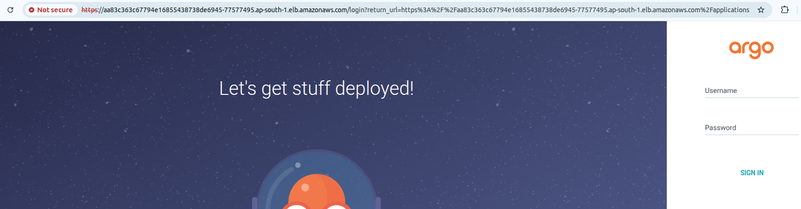

# AWS EKS Cluster Deployment using Terraform

This project provisions an AWS EKS (Elastic Kubernetes Service) cluster with supporting VPC infrastructure, subnets, IAM users, and necessary permissions using Terraform.

## 📋 Prerequisites

Before you begin, ensure you have the following:

- **AWS Account**
- **IAM User** with programmatic access and admin privileges
- **Terraform** ≥ v1.3.0 installed
- **AWS CLI** ≥ v2 installed and configured
- Basic knowledge of:
  - Terraform modules and state management
  - Kubernetes and AWS services

## 🧰 Tools Used

| Tool       | Purpose                        |
|------------|--------------------------------|
| Terraform  | Infrastructure as Code (IaC)   |
| AWS        | Cloud provider                 |
| EKS        | Managed Kubernetes service     |
| IAM        | User and permissions management|

---

## 📁 Project Structure

```bash
.
├── main.tf                    # Main Terraform config file
├── variables.tf              # Input variables
├── outputs.tf                # Output values
├── testuser-policy.json      # JSON policy file for IAM user
├── terraform.tfvars          # Variable values
└── README.md                 # Project documentation
````

---

## 📦 Modules Used

### VPC Module

Using [terraform-aws-modules/vpc/aws](https://registry.terraform.io/modules/terraform-aws-modules/vpc/aws)

* Creates a VPC with:

  * Public and private subnets across 3 AZs
  * NAT gateway
  * No VPN gateway

### EKS Module

Using [terraform-aws-modules/eks/aws](https://registry.terraform.io/modules/terraform-aws-modules/eks/aws)

* Provisions:

  * EKS control plane (public endpoint enabled)
  * Managed node group
  * Cluster addons (CoreDNS, kube-proxy, etc.)
  * Admin access to cluster creator

---

## 👤 IAM User and Policy

* Creates a test IAM user with a custom inline policy from `testuser-policy.json`
* Attaches the policy to the user

---

## 📌 Variables Overview

Here are some key variables to define in your `terraform.tfvars`:

```hcl
vpcname        = "my-eks-vpc"
cidr           = "10.0.0.0/16"
cluster-name   = "my-eks-cluster"
instance_type  = "t3.medium"
environment    = "dev"
testusername   = "eks-test-user"
userpolicy     = "testuser-access-policy"
```

---

## 🚀 Deployment Steps

1. **Clone the repo**

   ```bash
   git clone <your-repo-url>
   cd <repo-directory>
   ```

2. **Initialize Terraform**

   ```bash
   terraform init
   ```

3. **Review Terraform plan**

   ```bash
   terraform plan
   ```

4. **Apply the configuration**

   ```bash
   terraform apply
   ```

5. **Get EKS Credentials**

   ```bash
   aws eks update-kubeconfig --region ap-south-1 --name my-eks-cluster
   ```

6. **Verify the Cluster**

   ```bash
   kubectl get nodes
   ```

---

## 📊 Architecture Diagram


*If not available: replace `architecture.png` with a generated image or diagram.*

This infrastructure sets up:

* A VPC with public and private subnets
* A managed EKS cluster
* A managed node group
* IAM user with attached policy

---

## 🛑 Destroy Resources

To destroy all provisioned resources:

```bash
terraform destroy
```

---

## ✅ Validation Checklist

* [x] VPC created with public/private subnets
* [x] EKS cluster reachable via kubectl
* [x] Worker nodes join the cluster
* [x] IAM user created and policy attached


---
Here’s a complete and professional `README.md` file tailored to help you deploy a **Nginx application on GKE using Argo CD**, assuming your GKE cluster is already up and running.

---

# 🚀 NGINX Deployment on GKE using Argo CD

This repository contains resources and instructions to deploy a sample NGINX application to **Google Kubernetes Engine (GKE)** using **Argo CD** for GitOps-style continuous deployment.

---

## 📋 Prerequisites

Before proceeding, ensure you have the following:

### ✅ Tools Installed

* [kubectl](https://kubernetes.io/docs/tasks/tools/)
* [gcloud CLI](https://cloud.google.com/sdk/docs/install)
* [helm](https://helm.sh/docs/intro/install/)
* [Argo CD CLI (optional)](https://argo-cd.readthedocs.io/en/stable/cli_installation/)
* [Git](https://git-scm.com/downloads)

### ✅ GKE Cluster

* A running GKE cluster with your kubeconfig set:

  ```bash
  gcloud container clusters get-credentials <cluster-name> --region <region>
  ```

---

## 🛠️ Step-by-Step Guide

### 1. ✅ Clone This Repository

```bash
git clone https://github.com/your-org/argocd-nginx-on-gke.git
cd argocd-nginx-on-gke
```

### 2. 🚀 Install Argo CD on GKE

Create a namespace and install Argo CD via Helm or manifests.

```bash
kubectl create namespace argocd
kubectl apply -n argocd -f https://raw.githubusercontent.com/argoproj/argo-cd/stable/manifests/install.yaml
```

> 📌 **Note**: You can also install Argo CD using Helm if preferred.

### 3. 🔐 Get Argo CD Admin Password

```bash
kubectl -n argocd get secret argocd-initial-admin-secret -o jsonpath="{.data.password}" | base64 -d
```

### 4. 🌐 Expose Argo CD Server

To access Argo CD UI externally (temporary):

```bash
kubectl port-forward svc/argocd-server -n argocd 8080:443
```

Access it via: [https://localhost:8080](https://localhost:8080)

> Login with username: `admin` and the password from the previous step.

---

## 📦 Application Deployment Files

### 1. Create Application Namespace

```bash
kubectl create namespace nginx-app
```

### 2. Application Manifest Structure

Create the following folder structure:

```
nginx-app/
├── deployment.yaml
├── service.yaml
├── kustomization.yaml
```

#### `deployment.yaml`

```yaml
apiVersion: apps/v1
kind: Deployment
metadata:
  name: nginx
  namespace: nginx-app
spec:
  replicas: 2
  selector:
    matchLabels:
      app: nginx
  template:
    metadata:
      labels:
        app: nginx
    spec:
      containers:
      - name: nginx
        image: nginx:latest
        ports:
        - containerPort: 80
```

#### `service.yaml`

```yaml
apiVersion: v1
kind: Service
metadata:
  name: nginx-service
  namespace: nginx-app
spec:
  selector:
    app: nginx
  ports:
  - protocol: TCP
    port: 80
    targetPort: 80
  type: LoadBalancer
```

#### `kustomization.yaml`

```yaml
resources:
  - deployment.yaml
  - service.yaml
```

---

## 🔧 Configure Argo CD Application

Once Argo CD is installed and accessible, configure your application.

### Option 1: Web UI

* Login to Argo CD UI
* Click **New App**
* Fill:

  * **Application Name**: `nginx`
  * **Project**: `default`
  * **Sync Policy**: Manual or Automatic
  * **Repository URL**: Git repo URL
  * **Path**: `k8s/argo`
  * **Cluster**: `https://kubernetes.default.svc`
  * **Namespace**: `nginx-app`
* Click **Create**

### Option 2: Using CLI

```bash
argocd app create nginx \
  --repo https://github.com/your-org/argocd-nginx-on-gke.git \
  --path nginx-app \
  --dest-server https://kubernetes.default.svc \
  --dest-namespace nginx-app
```

Sync it:

```bash
argocd app sync nginx
```

---

## ✅ Verify Deployment

Check resources:

```bash
kubectl get pods -n nginx-app
kubectl get svc -n nginx-app
```

Access NGINX via external IP (from LoadBalancer service).

---

## 📸 Recommended Screenshot Suggestions

Add the screenshots like:

```markdown
### Argo CD Dashboard


### NGINX Pods Running

### NGINX Page


## 🧼 Cleanup

```bash
kubectl delete namespace nginx-app
argocd app delete nginx
```

---

## 📘 References

* [Argo CD Documentation](https://argo-cd.readthedocs.io/)
* [GKE Documentation](https://cloud.google.com/kubernetes-engine/docs)
* [Kustomize](https://kubectl.docs.kubernetes.io/references/kustomize/)

---

Let me know if you want this turned into a downloadable `README.md` file or need help with Git setup!


This project is licensed under the MIT License.

```

---

Would you also like me to generate and send the architecture diagram image (`architecture.png`) mentioned above?
```
