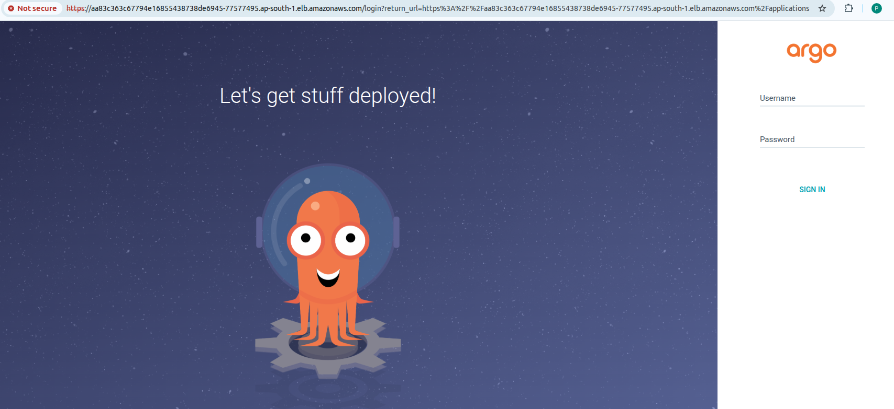

# AWS EKS Cluster Deployment using Terraform

This project provisions an AWS EKS (Elastic Kubernetes Service) cluster with supporting VPC infrastructure, subnets, IAM users, and necessary permissions using Terraform.

## 📋 Prerequisites

Before you begin, ensure you have the following:

- **AWS Account**
- **IAM User** with programmatic access and admin privileges
- **Terraform** ≥ v1.3.0 installed
- **AWS CLI** ≥ v2 installed and configured
- Basic knowledge of:
  - Terraform modules and state management
  - Kubernetes and AWS services

## 🧰 Tools Used

| Tool       | Purpose                        |
|------------|--------------------------------|
| Terraform  | Infrastructure as Code (IaC)   |
| AWS        | Cloud provider                 |
| EKS        | Managed Kubernetes service     |
| IAM        | User and permissions management|

---

## 📁 Project Structure

```bash
.
├── main.tf                    # Main Terraform config file
├── variables.tf              # Input variables
├── outputs.tf                # Output values
├── testuser-policy.json      # JSON policy file for IAM user
├── terraform.tfvars          # Variable values
└── README.md                 # Project documentation
````

---

## 📦 Modules Used

### VPC Module

Using [terraform-aws-modules/vpc/aws](https://registry.terraform.io/modules/terraform-aws-modules/vpc/aws)

* Creates a VPC with:

  * Public and private subnets across 3 AZs
  * NAT gateway
  * No VPN gateway

### EKS Module

Using [terraform-aws-modules/eks/aws](https://registry.terraform.io/modules/terraform-aws-modules/eks/aws)

* Provisions:

  * EKS control plane (public endpoint enabled)
  * Managed node group
  * Cluster addons (CoreDNS, kube-proxy, etc.)
  * Admin access to cluster creator

---

## 👤 IAM User and Policy

* Creates a test IAM user with a custom inline policy from `testuser-policy.json`
* Attaches the policy to the user

---

## 📌 Variables Overview

Here are some key variables to define in your `terraform.tfvars`:

```hcl
vpcname        = "my-eks-vpc"
cidr           = "10.0.0.0/16"
cluster-name   = "my-eks-cluster"
instance_type  = "t3.medium"
environment    = "dev"
testusername   = "eks-test-user"
userpolicy     = "testuser-access-policy"
```

---

## 🚀 Deployment Steps

1. **Clone the repo**

   ```bash
   git https://github.com/prajeshgitre/devops-task.git
   cd devops-tasks/terraform
   ```

2. **Initialize Terraform**

   ```bash
   terraform init
   ```

3. **Review Terraform plan**

   ```bash
   terraform plan


4. **Apply the configuration**

   ```bash
   terraform apply
   ```
   
   

5. **Get EKS Credentials**

   ```bash
   aws eks update-kubeconfig --region ap-south-1 --name my-eks-cluster
   ```

6. **Verify the Cluster**

   ```bash
   kubectl get nodes
   ```


# 🚀 EKS Deployment with Manual and Argo CD-based NGINX App

This project sets up an EKS cluster using Terraform and deploys a sample NGINX application in two ways:
1. Manual deployment using `kubectl`
2. GitOps deployment using Argo CD

---

## 📌 Prerequisites

- AWS CLI configured (`aws configure`)
- Terraform installed
- `kubectl` installed and configured with your EKS cluster
- Argo CD CLI installed (`argocd`)
- GitHub repo containing your manifests

---

## 📁 Folder Structure

```

.
├── images/
│   ├── nginx\_nodeport
│   ├── argocd\_dashboard.png
│   └── nginx\_app\_synced.png
├── k8s/
│   └── deployment/
│       ├── deployment.yaml
│       └── service.yaml
├── argo/
│   └── argocd-app.yaml
├── terraform/
│   ├── main.tf
│   ├── variable.tf
│   ├── provider.tf
│   ├── output.tf
│   └── testuser-policy.json
└── README.md

````

---

## ☸️ Step 1: Create EKS Cluster via Terraform

```bash
cd terraform/
terraform init
terraform apply
````

This will create the EKS cluster and required IAM policies.

---

## 🌐 Step 2: Manual Deployment of NGINX using NodePort

Create a sample NGINX app and expose it manually:

**deployment.yaml**

```yaml
apiVersion: apps/v1
kind: Deployment
metadata:
  name: nginx-deployment
spec:
  replicas: 2
  selector:
    matchLabels:
      app: nginx
  template:
    metadata:
      labels:
        app: nginx
    spec:
      containers:
      - name: nginx
        image: nginx:latest 
        ports:
        - containerPort: 80
```

**service.yaml**

```yaml
apiVersion: v1
kind: Service
metadata:
  name: nginx-service
spec:
  selector:
    app: nginx
  ports:
    - protocol: TCP
      port: 80
      targetPort: 80
      nodePort: 30081
  type: NodePort
```

Apply these:

```bash
kubectl apply -f k8s/deployment/deployment.yaml
kubectl apply -f k8s/deployment/service.yaml
```

Access via port forwarding or node public IP.


## 🚀 Step 3: Install Argo CD on EKS

```bash
kubectl create namespace argocd
kubectl apply -n argocd -f https://raw.githubusercontent.com/argoproj/argo-cd/stable/manifests/install.yaml
```

---

## 🔧 Step 4: Install Argo CD CLI

```bash
curl -sSL -o argocd-linux-amd64 https://github.com/argoproj/argo-cd/releases/latest/download/argocd-linux-amd64
sudo install -m 555 argocd-linux-amd64 /usr/local/bin/argocd
rm argocd-linux-amd64
```

---

## 🌐 Step 5: Expose Argo CD API via LoadBalancer

```bash
kubectl patch svc argocd-server -n argocd -p '{"spec": {"type": "LoadBalancer"}}'
```

Wait a few minutes for the external IP.



---

## 🔐 Step 6: Login to Argo CD

Get initial password:

```bash
kubectl -n argocd get secret argocd-initial-admin-secret -o jsonpath="{.data.password}" | base64 -d
```

Login:

```bash
argocd login <ARGO_SERVER> --username admin --password <PASSWORD>
```

---

## 📦 Step 7: Deploy NGINX via Argo CD (GitOps)

**Create Argo CD Application**

`argo/argocd-app.yaml`

```yaml
apiVersion: argoproj.io/v1alpha1
kind: Application
metadata:
  name: nginx-app
  namespace: argocd
spec:
  project: devops
  source:
    repoURL: 'https://github.com/prajeshgitre/devops-task.git'
    targetRevision: main
    path: 'k8s/deployment'
  destination:
    server: 'https://kubernetes.default.svc'
    namespace: argocd
  syncPolicy:
    automated:
      prune: true
      selfHeal: true
    syncOptions:
      - CreateNamespace=true
      - PruneLast=true
      - PrunePropagationPolicy=foreground
```

Apply:

```bash
kubectl apply -f argo/argocd-app.yaml
```

Once synced, your app will be deployed automatically by Argo CD.


-

``
